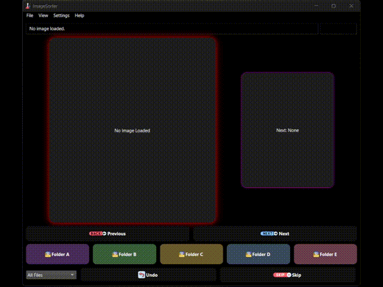
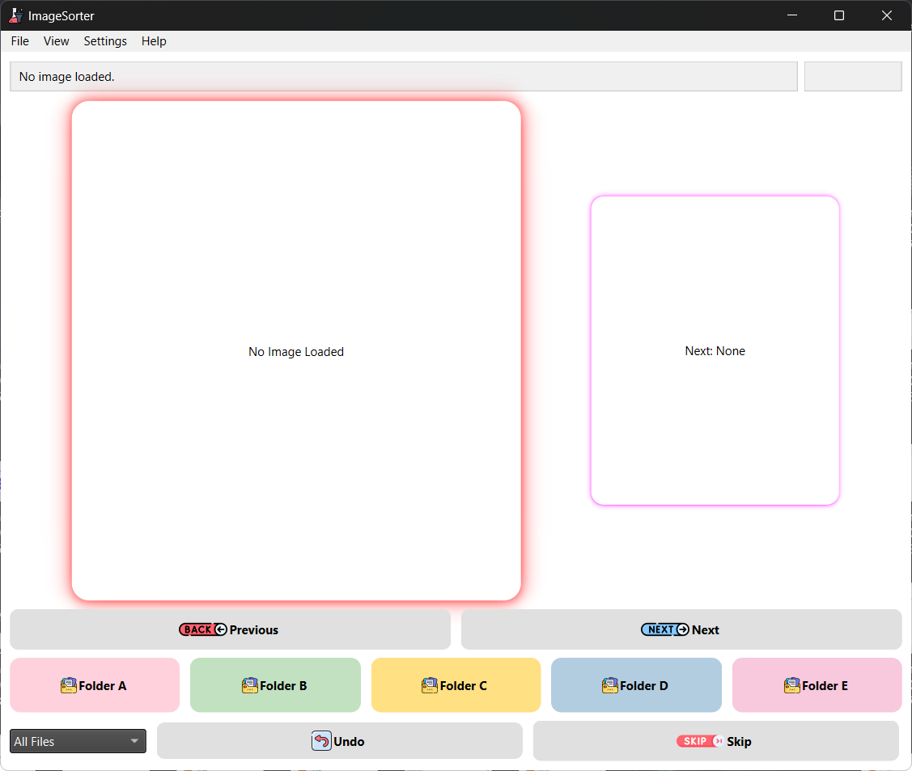
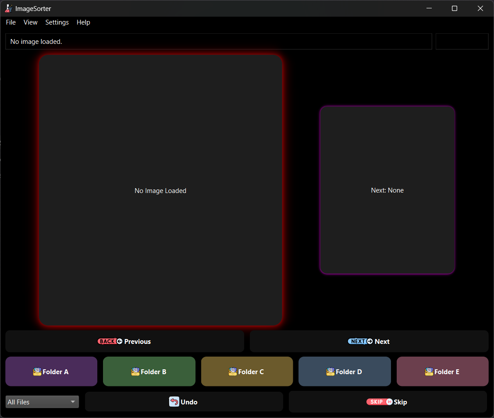

<div align="center">
  <h1 style="display: inline-flex; align-items: center; justify-content: center; gap: 10px;">
    
    Image Sorter
  </h1>
</div>

<div align="center">
  <strong>A sleek and powerful image sorting application with drag & drop support, undo functionality, and customizable themes.</strong>
</div>

<br />

<div align="center">
  <!-- Badges -->
  <a href="LICENSE"></a>
  <a href="https://github.com/Zy0x/ImageSorter/releases/latest"></a>
  <a href="#"></a>   
  <a href="#"></a>
  <a href="https://github.com/Zy0x/ImageSorter/stargazers"></a>
</div>

<br />

<div align="center">
  
</div>

---

## 📝 Description  

**Image Sorter** is a modern desktop application built with PySide6 that allows users to sort thousands of images into custom folders with just one click. Featuring an intuitive UI, automatic dark/light mode support, smooth animations, keyboard shortcuts, and an undo system, this app is ideal for photographers, designers, or anyone managing large photo collections.

‎ 
## ✨ Key Features

✔️ **Fast Image Sorting** – Move images to target folders using single keys (A–E).  
✔️ **Undo Action** – Quickly undo the last action (`Ctrl+Z`).  
✔️ **Drag & Drop Support** – Drag and drop folders/images directly into the app.  
✔️ **Responsive Preview** – Main image preview with smooth transition effects.  
✔️ **Custom Themes** – Customize background color, text, buttons, borders, and shadows.  
✔️ **Recent Folder History** – Access recently opened folders instantly from the Recent menu.  
✔️ **Keyboard Shortcuts** – Use `← / →`, `A / D`, `Space`, `Ctrl+Z`, etc.  
✔️ **Image Extension Filter** – Show only `.png`, `.jpg`, `.gif`, etc.  
✔️ **Activity Log Export** – Track all sorting activities into a `.txt` file.  
✔️ **Import/Export Settings** – Save/load configurations including folder names, paths, and themes.  
✔️ **Dynamic Folder Setup** – Manually edit destination folders via the settings dialog.  
✔️ **Progress Bar on Load** – Shows file validation when loading large folders.  
✔️ **Temporary UI Notifications** – Appears at the bottom for important messages.  
✔️ **Multi-Resolution Image Handling** – Resized responsively without distortion.

---

## 🔧 Requirements

Ensure you have Python >= 3.8 installed. Install dependencies using:

```bash
pip install -r requirements.txt
```

‎ 
## 🚀 Getting Started

There are two main ways to use **Image Sorter**:

### ✅ Option 1: Download & Install (Windows)

1. Visit the [GitHub Releases](https://github.com/Zy0x/ImageSorter/releases/latest) page.
2. Download the latest `.exe` installer (e.g., `ImageSorter-Setup-v1.0.exe`).
3. Run the installer and follow the setup wizard.
4. During installation, you'll be given two options:
   - **Default Installation**: Installs the app fully with desktop shortcut and Start Menu entry.
   - **Portable Mode**: Choose this if you want to keep everything in a single folder — ideal for USB drives or temporary machines.

> 💡 After installation, launch the app from the shortcut or directly from the installation directory.


‎ 
### 💻 Option 2: Run from Source (For Developers or Advanced Users)

If you prefer to run from source (for development or customization):

1. **Download ZIP Project**
   - Click **Code > Download ZIP** from the GitHub repository.
2. **Extract ZIP**
   - Extract to your local folder.
3. **Install Dependencies**
   ```bash
   pip install -r requirements.txt
   ```
4. **Run the App**
   ```bash
   python main.py
   ```

---

## 🎨 Themes & Customization

You can switch between:
- **Light Mode**
- **Dark Mode**
- **System Default**
- **Custom Theme**

Customizable elements:
- Background color
- Text color
- Button styles and hover effects
- Border and shadow styles

‎ 
## 📦 Import & Export Settings

- **Export Settings**: Save configuration to a `.json` file.
- **Import Settings**: Reload saved configuration from a JSON file.
- **Export Log**: Export activity log to a `.txt` file.

‎ 
## 🌐 License

MIT License — see [LICENSE](LICENSE) for details.

‎ 
## 👤 Author

👤 **Zy0x**

- GitHub: [@Zy0x](https://github.com/Zy0x)  
- Telegram: [@Thea](https://t.me/ThuandMuda)

‎ 

## 🙌 Contributing

Contributions are welcome! Feel free to open an issue or submit a pull request to help improve this project.

‎ 
## 📷 Screenshots

| Light Mode | Dark Mode |
|------------|-----------|
|  |  |

‎ 
## 📬 Feedback

If you have suggestions, bug reports, or want to contribute, feel free to reach out via:

- Telegram: [@Thea](https://t.me/ThuandMuda)  
- GitHub: [@Zy0x](https://github.com/Zy0x)

---

> ⚡ Organize your photos in seconds — effortlessly.  
> **Made with ❤️ using Python & PySide6**

---
